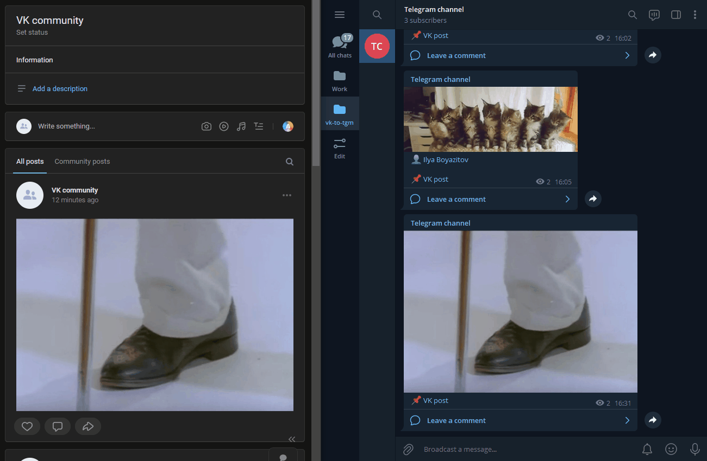
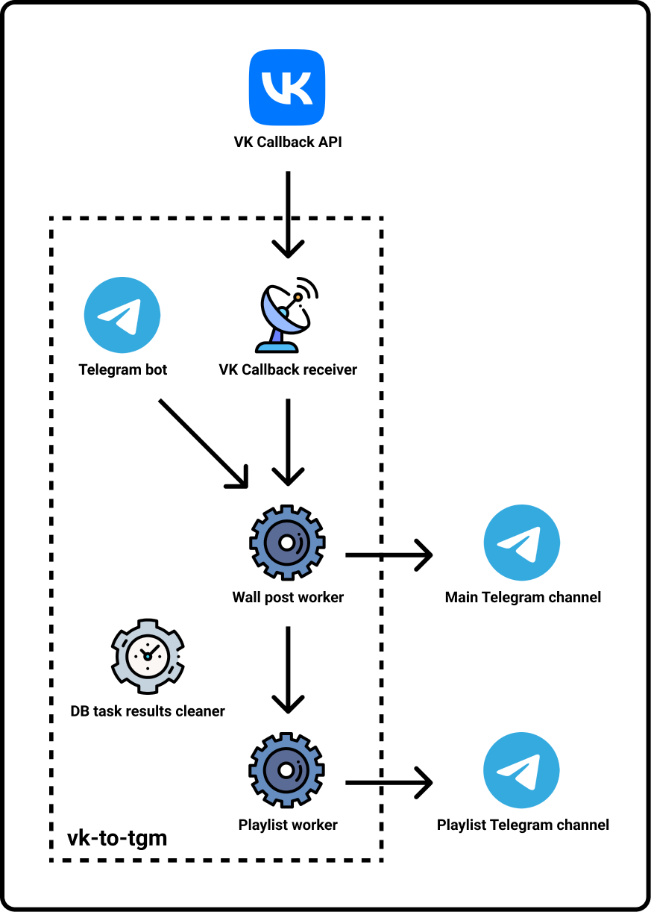

# vk-to-tgm

An application that forwards wall posts and playlists from VK community to Telegram channel.



Working example: <https://t.me/mashup_vk>

## What can it forward

| VK          | Telegram | Notes                                                                                                                                                                                 |
|-------------|----------|---------------------------------------------------------------------------------------------------------------------------------------------------------------------------------------|
| Text        | ✅        | Will be splitted into multpile messages if VK text is too big.                                                                                                                        |
| Photo       | ✅        | Will be posted with the largest size available.                                                                                                                                       |
| Video       | ✅        | VK videos will be uploaded directly (up to 720p). External videos (YouTube, Vimeo, etc.) will be at the top in the form of links, so that the first one will be shown in the preview. |
| Audio       | ✅        | Will be posted in separate message.                                                                                                                                                   |
| File        | ✅        | Will be posted in separate message.                                                                                                                                                   |
| Poll        | ✅        | Will be posted in separate message.                                                                                                                                                   |
| Market      | ✅        | Will be in the form of link.                                                                                                                                                          |
| Playlist    | ✅        | Additional Telegram channel is required. There will be separate message in the main channel with the link to the message in the playlist channel, where audios will be uploaded.      |
| Link        | ✅        | Will be shown just as VK link.                                                                                                                                                        |
| Article     | ✅        | Will be in the form of link.                                                                                                                                                          |
| Poster      | ✅        | Works the same way as with the photo.                                                                                                                                                 |
| Graffiti    | ✅        | Works the same way as with the photo.                                                                                                                                                 |
| Map         | ✅        | Will be posted in separate message.                                                                                                                                                   |
| Live stream | ✅        | Will be posted at the top in the form of link.                                                                                                                                        |

> [!NOTE]
> if a post was edited in VK, it will NOT be edited in Telegram. As a workaround, you can delete old Telegram messages and reforward edited post through the Telegram bot.

## Requirements

- Docker
- [VK community token with access to community management](https://vk.com/dev/access_token)
- VK account
- Telegram channel (and additional channel if you need playlists)
- Telegram account
- [Telegram bot token](https://core.telegram.org/bots#3-how-do-i-create-a-bot)
- [Telegram application](https://core.telegram.org/api/obtaining_api_id)

## Installation

1. Set environment variables manually in `.env` file (see [.env.example](.env.example)) or by running these commands:

    ```sh
    # Go to the root directory of this repository
    cd "$(git rev-parse --show-toplevel)"

    # Build env_helper
    docker build -t env_helper projects/env_helper

    # Run env_helper
    docker run --rm -it -v "$(pwd)/out":/tmp/out env_helper

    # Copy resulting '.env' file to the root directory
    cp out/.env .env
    ```

2. After that, you have two options:
   - Run the application without SSL certificate:

        ```sh
        docker compose up --build --remove-orphans

        # Or, if you also want to handle playlists
        docker compose --profile with-pl up --build --remove-orphans
        ```

   - Run the application with SSL certificate - read [this guide](SSL.md).

## Uninstallation

```sh
docker compose down -v --rmi all --remove-orphans
```

## Migration from v1

1. Backup `.env` file.
2. Run `uninstall.sh` script if vk-to-tgm was installed locally.
3. Rename environment variables.
4. [Install with docker](#installation)

## Architecture

It consists of the following services:

- Server that receives VK Callback events
- Telegram bot that forwards wall posts or playlists by user request
- Celery worker that forwards wall posts
- (optional) Celery worker that forwards playlists



## License

GNU General Public License v3.0 or later.

See [LICENSE](LICENSE) file.
