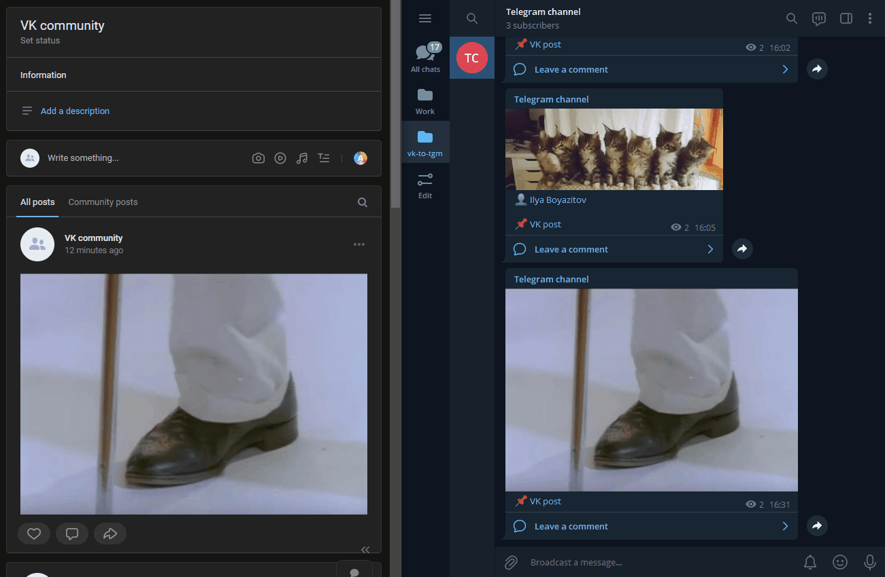

# vk-to-tgm

An application that forwards wall posts and playlists from VK community to Telegram channel.



🔗 [Telegram Channel Example](https://t.me/mashup_vk)

## Supported Content Types

| VK Content Type | Notes                                                                                             |
| --------------- | ------------------------------------------------------------------------------------------------- |
| Text            | Split into multiple messages if too long.                                                         |
| Photo           | Posted in the largest available size.                                                             |
| Video           | Direct VK videos up to 720p; external videos (YouTube, etc.) are shared as links with preview.    |
| Audio           | Sent as a separate message.                                                                       |
| File            | Sent as a separate message.                                                                       |
| Poll            | Sent as a separate message.                                                                       |
| Market          | Shared as a link.                                                                                 |
| Playlist        | Requires a dedicated Telegram channel. A link to the playlist will be posted in the main channel. |
| Link            | Shared as is.                                                                                     |
| Article         | Shared as a link.                                                                                 |
| Poster          | Treated like a photo.                                                                             |
| Graffiti        | Treated like a photo.                                                                             |
| Map             | Sent as a separate message.                                                                       |
| Live stream     | Shared as a link at the top of the post.                                                          |

> [!NOTE]
> Edited posts in VK **won't be updated** in Telegram. To reflect changes, delete the old Telegram messages and re-forward the updated post using the Telegram bot.

## Requirements

- Docker
- [VK community token with access to community management](https://vk.ru/dev/access_token)
- VK account
- Telegram channel (and an additional one if you plan to use playlist forwarding)
- Telegram account
- [Telegram bot token](https://core.telegram.org/bots#3-how-do-i-create-a-bot)
- [Telegram application](https://core.telegram.org/api/obtaining_api_id)

## Installation

1. Set environment variables manually in `.env` file (see [.env.example](.env.example)) or by running these commands:

    ```sh
    # Go to the root directory of this repository
    cd "$(git rev-parse --show-toplevel)"

    # Build env_helper
    docker build --build-arg UID=$(id -u) --build-arg GID=$(id -g) -t env_helper projects/env_helper

    # Run env_helper
    mkdir -p out && docker run --rm -it -v "$(pwd)/out":/tmp/out env_helper

    # Copy resulting '.env' file to the root directory
    cp out/.env .env
    ```

2. After that, you have two options:
   - Run the application without SSL certificate:

        ```sh
        COMPOSE_PROFILES=http docker compose up -d --build --remove-orphans

        # Or, if you also want to handle playlists
        COMPOSE_PROFILES=http,with-pl docker compose up -d --build --remove-orphans
        ```

   - Run the application with SSL certificate - read [this guide](SSL.md).

## Uninstallation

```sh
docker compose down -v --rmi all --remove-orphans
```

## Migration from v1

1. Backup your current `.env` file.
2. Run `uninstall.sh` script if vk-to-tgm was installed locally.
3. Copy `.env` file from the backup and change environment variables:
   1. Rename variables:
      - `KATE_TOKEN` to `VK_KATE_TOKEN`
      - `VK_IGNORE_ADS` to `VTT_IGNORE_ADS`
      - `NGINX_HOST` to `NGINX_SERVER_NAME`
   2. Remove deprecated variables:
      - `VK_LOGIN`
      - `VK_PASSWORD`
      - `VK_OFFICIAL_TOKEN`
      - `VK_API_LANGUAGE`
4. Create `out/` directory and copy `.env` there:

   ```sh
   mkdir -p out && cp .env out/.env
   ```

5. [Reinstall using Docker](#installation)

## License

GNU General Public License v3.0 or later.

See [LICENSE](LICENSE) file.
