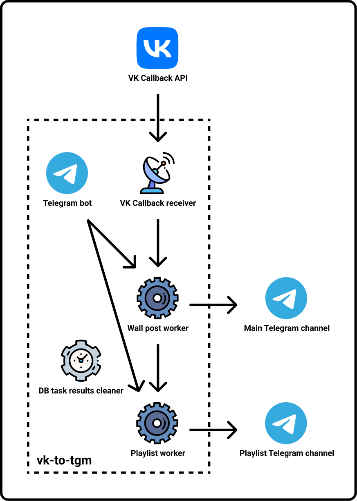

# vk-to-tgm

An application that forwards wall posts and playlists from VK community to Telegram channel.

Consists of following services:
- Server that receives VK Callback events
- Telegram bot that forwards wall posts or playlists by user request
- Celery worker that forwards wall posts
- (optional) Celery worker that forwards playlists
- Celery Beat service, that cleans up a SQLite3 database task results

## Requirements: 
- Python 3.8+
- RabbitMQ Server
- FFmpeg
- [VK community token with access to community management](https://vk.com/dev/access_token)
- VK account
- Telegram channel (and additional channel if you need playlists)
- Telegram account
- [Telegram bot token](https://core.telegram.org/bots#3-how-do-i-create-a-bot)
- [Telegram application](https://core.telegram.org/api/obtaining_api_id)

## What can it forward

| VK          | Telegram | Notes                                                                                                                                                                                 |
|-------------|----------|---------------------------------------------------------------------------------------------------------------------------------------------------------------------------------------|
| Text        | ✅        | Will be splitted into multpile messages if VK text is too big.                                                                                                                        |
| Photo       | ✅        | Will be posted with the largest size available.                                                                                                                                       |
| Video       | ✅        | VK videos will be uploaded directly (up to 720p). External videos (YouTube, Vimeo, etc.) will be at the top in the form of links, so that the first one will be shown in the preview. |
| Audio       | ✅        | Will be posted in separate message.                                                                                                                                                   |
| File        | ✅        | Will be posted in separate message.                                                                                                                                                   |
| Poll        | ✅        | Will be posted in separate message.                                                                                                                                                   |
| Market      | ✅        | Will be in the form of link.                                                                                                                                                          |
| Playlist    | ✅        | Additional Telegram channel is required. There will be separate message in the main channel with the link to the message in the playlist channel, where audios will be uploaded.      |
| Link        | ✅        | Will be shown just as VK link.                                                                                                                                                        |
| Article     | ✅        | Will be in the form of link.                                                                                                                                                          |
| Poster      | ✅        | Works the same way as with the photo.                                                                                                                                                 |
| Graffiti    | ✅        | Works the same way as with the photo.                                                                                                                                                 |
| Map         | ✅        | Will be posted in separate message.                                                                                                                                                   |
| Live stream | ✅        | Will be posted at the top in the form of link.                                                                                                                                        |

**NOTE:** if post was edited in VK, it will NOT be edited in Telegram. As a workaround, you can delete old Telegram messages and reforward edited post through Telegram bot.

## Example

Working example: https://t.me/mashup_vk

## Install
Clone this repository and run `install.sh` script.

If you want to install client SSL certificate, read [here](setup/ssl/README.md).

## Uninstall
Run `uninstall.sh` script.

## Logs
You can check logs in the `logs/` directory.

## License
GNU General Public License v3.0 or later.

See [LICENSE](LICENSE) file.
